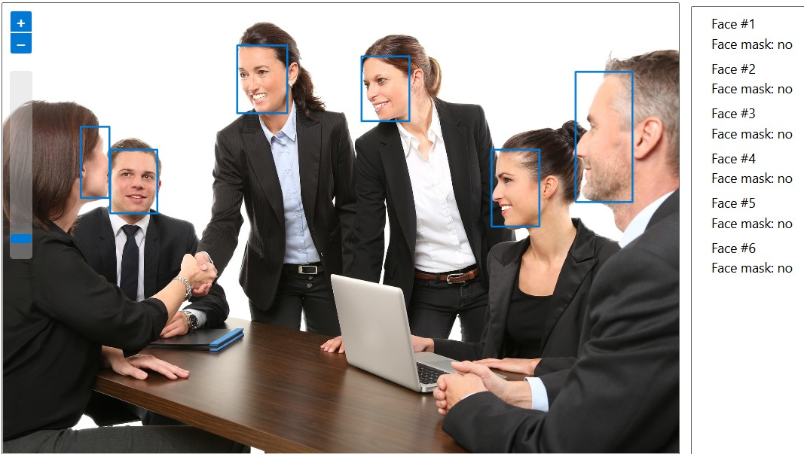
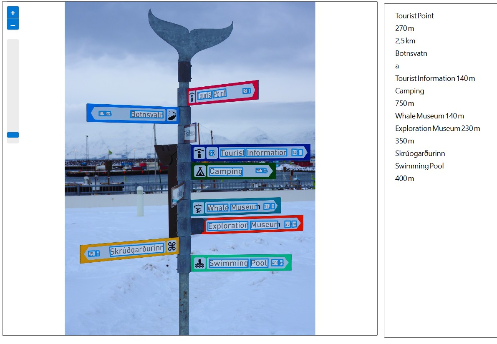

# Projeto - Fundamentos de Inteligência Artificial com Azure Vision

Este projeto foi desenvolvido como parte do curso **Fundamentos de IA da Microsoft pela DIO**. O objetivo foi aplicar na prática os conceitos estudados utilizando os recursos do **Azure AI Vision Studio**, explorando três funcionalidades principais:

- Detecção de rostos em imagens
- Extração de texto (OCR)
- Descrição de imagens (captioning)

## 🎯 Objetivo

Explorar as capacidades dos serviços de Visão Computacional da Azure AI para analisar imagens e gerar insights a partir delas. A ideia foi simular um caso real de aplicação de IA, onde diferentes tipos de análises visuais são necessárias.

## 🧪 Ferramentas Utilizadas

- [Azure Vision Studio](https://portal.vision.cognitive.azure.com/)
- Serviço **Azure AI Services**
- Funcionalidades:
  - [Detecção de rostos](https://portal.vision.cognitive.azure.com/demo/face-detection)
  - [Reconhecimento de texto (OCR)](https://portal.vision.cognitive.azure.com/demo/extract-text-from-images)
  - [Descrição de imagens](https://portal.vision.cognitive.azure.com/demo/image-captioning)

---

## ⚙️ Passo a Passo

### 1. Criação do Serviço no Azure

1. Acesse o [portal do Azure](https://portal.azure.com).
2. Clique em **Criar um recurso** > pesquise por **Azure AI Services**.
3. Selecione um grupo de recursos ou crie um novo.
4. Escolha a região mais próxima (ex: East US 2).
5. Nomeie seu recurso (ex: `ai-vision-projeto`).
6. Plano de preço: **Padrão S0**.
7. Clique em **Revisar + Criar**, e depois **Criar**.
8. Após criado, acesse o [Vision Studio](https://portal.vision.cognitive.azure.com).

### 2. Upload e Análise das Imagens

- As imagens foram organizadas nas pastas `inputs/faces`, `inputs/ocr` e `inputs/description`.
- Foram utilizadas 3 imagens para cada tipo de análise.
- Após a análise via demos do Vision Studio, as saídas foram salvas em `outputs/` com o mesmo nome do arquivo de entrada.

---

## 🖼️ Prints dos Resultados

### 🧍 Detecção de Rostos

**Exemplo:**

---

### 🔤 Reconhecimento de Texto

**Exemplo:**

---

### 🏙️ Descrição de Imagem

**Exemplo:**

---

## 💡 Insights Obtidos

- O **serviço de OCR** consegue identificar texto em imagens com ótima precisão, inclusive em ângulos ou com ruído.
- A **detecção de rostos** é eficiente, com capacidade de identificar expressões, idade estimada, presença de óculos, etc.
- A **descrição de imagens** retorna legendas bastante coerentes, podendo ser utilizada em soluções de acessibilidade e organização de imagens.

---

## 🔗 Links Úteis

- [Azure Portal](https://portal.azure.com)
- [Vision Studio](https://portal.vision.cognitive.azure.com)
- [Documentação Azure AI Vision](https://learn.microsoft.com/en-us/azure/ai-services/computer-vision/)

---

## 📢 Conclusão

Este projeto demonstrou como é possível aplicar Inteligência Artificial de forma prática e acessível com o Azure. Utilizando o Vision Studio, foi possível realizar análises visuais em imagens diversas de maneira simples e rápida, com resultados bastante eficazes.

---

> Projeto realizado como parte do curso **"Fundamentos de IA"** oferecido pela Microsoft em parceria com a **DIO**.

